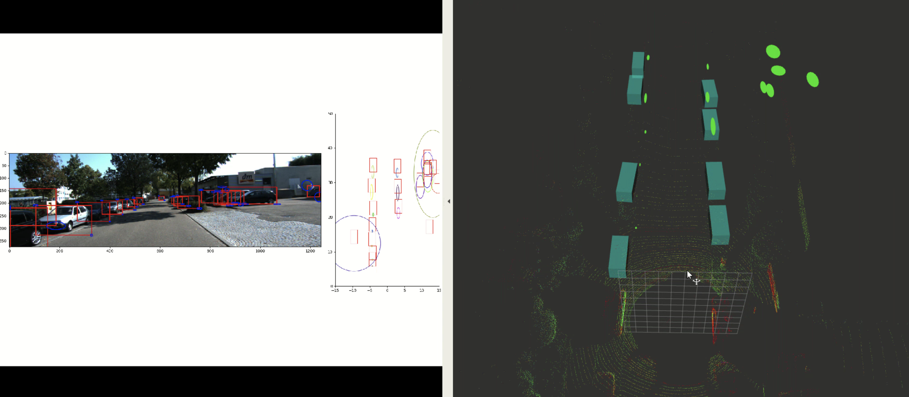

# Prob-OD
2D probabilistic object detection.

## Running Instructions

Download the dataset from Kitti benchmark and put it in `./datasets`

To train or test the model, you can run the following command. 

```python main.py --name "experiment_name" --mode train --resume True --weights /path_to_weights --epoch epoch_to_resume_training_or_test```

To run as the ros node, you can run it by 

```python model_node.py```


## Config Experiments

All the experiment hyper-params can be defined in `/src/config/`. 

Mention the path to load dataset and save experiments logs here. 


## Qualitative Results

